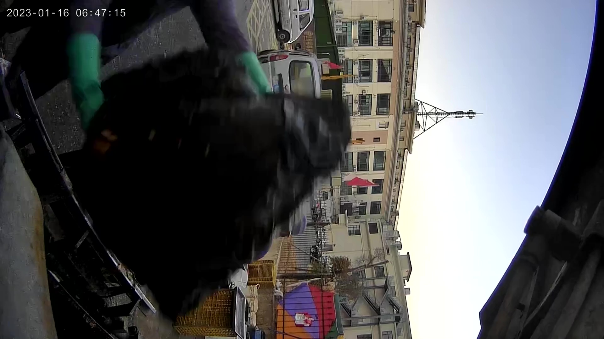
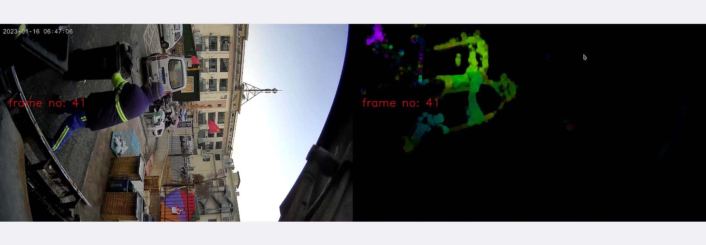
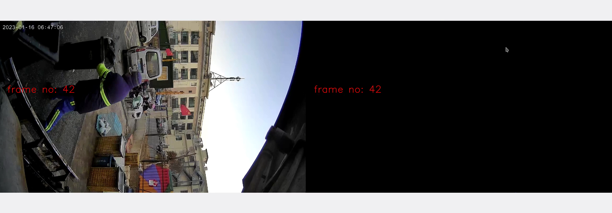
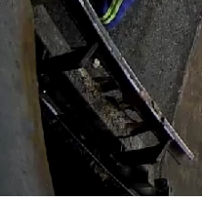

#  Question description

I want to track whether worker throw garbage into the truck manually in the video. 

## Q1: Is Dense Optical Flow in OpenCV a good solution for me?

## Q2: I tried to code a sample. But why the flow image is not continuous?
why frame No 42 is black?

## Q3: Can I spy on the color change in a small area to track if garbage through ? 
small area like this: 